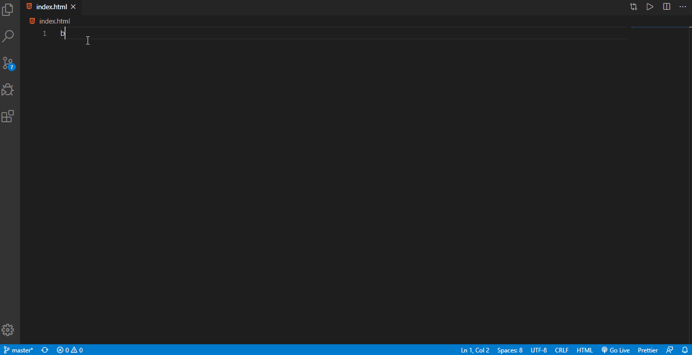
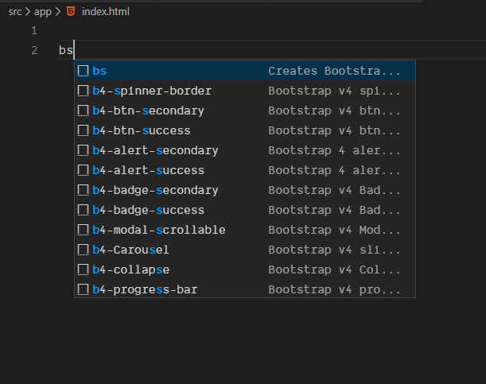

# Bootstrap Version v4 and v5 README

This is Bootstrap v4 and latest v5 `yrs 2020`.

## How to use

### Installation:

- Go to the vs code extension and click on install button, then restart the vs code.

### Bootstrap v4 and v5:

- To use the bootstrap v4 and v5 snippets in AngularJs, Angular 2+,any Js framework or in normal HTML file, just type `b4` and/or `b5` followed by pressing `Ctrl+Space`. List will be appears. Check the belows shortcuts.
  <!--  -->

### Bootstrap 4 shortcuts:

| For ...                                  | Type ...          |
| ---------------------------------------- | ----------------- |
| `Starter Template Bootstarp 4`           | bs4               |
| `Alert (For all colors)`                 | b4-alert          |
| `Badges (For all colors)`                | b4-badge          |
| `Breadcrumb (For all Type)`              | b4-breadcrumb     |
| `Button (For all Colors/Types)`          | b4-btn            |
| `Card`                                   | b4-card           |
| `Carousel`                               | b4-Carousel       |
| `Collapse`                               | b4-collapse       |
| `Dropdown`                               | b4-dropdown       |
| `Form`                                   | b4-form           |
| `Modal`                                  | b4-modal          |
| `Tabs`                                   | b4-tab            |
| `Navbar`                                 | b4-navbar-primary |
| `Pagination`                             | b4-pagination     |
| `Progress Bar`                           | b4-progress-bar   |
| `Spinner`                                | b4-spinner-border |
| `Table(normal,dark,bordered,borderless)` | b4-table          |

### Bootstrap 5 shortcuts:

| For ...                           | Type ...                    |
| --------------------------------- | --------------------------- |
| `Starter Template Bootstarp 5`    | bs5                         |
| `Readonly plain text in the form` | b5-form-readonly-plain-text |
| `Color picker`                    | b5-color-picker             |
| `Datalists`                       | b5-datalists                |
| `Select`                          | b5-select                   |
| `File Browser`                    | b5-file-browser             |
| `Form`                            | b5-form                     |
| `Form Grid`                       | b5-form-grid                |
| `Form Horizontal`                 | b5-form-horizontal          |
| `Form Inline`                     | b5-form-inline              |
| `Form Validation`                 | b5-form-validation          |
| `Navbar`                          | b5-navbar-primary           |
| `Badge`                           | b5-badge-primary            |

## Release Notes

`Please cheack the link for better understanding.`
[Bootstrap 5](https://v5.getbootstrap.com/docs/5.0/migration/)

### 2.0.0

**Enjoy😀**

<!-- $2 -->
